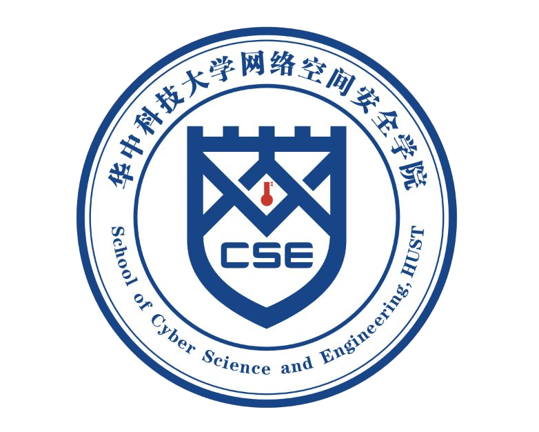

# 内容
华中科技大学网络空间安全学院（2020级）学习内容

个人归档用

# 实验
## 大一
1. [C语言实验](https://github.com/yllhwa/HUST-Lab-CLanguage)

## 大二
2. [程序设计综合](https://github.com/yllhwa/HUST-Lab-Programming)

## 大三上
1. [软件安全课程设计](https://github.com/yllhwa/SwordArtOffline)
2. [计算机通信与网络实验](https://github.com/yllhwa/HUST-Lab-Network)